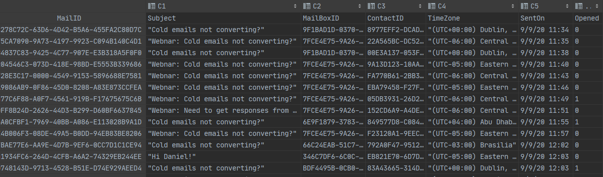

# PredictEmailOpened

## Task

Having data like:

Predict whether an email will be opened or not.

## Results

| global_step | tp   | tn    | fp   | fn   | mcc          | train_loss   | eval_loss    | auroc        | auprc        | f1           |
|-------------|------|-------|------|------|--------------|--------------|--------------|--------------|--------------|--------------|
| 626         | 376  | 13393 | 225  | 6035 | 0.1151935742 | 0.6418074965 | 0.6062818189 | 0.6228090916 | 0.4420890947 | 0.1072447233 |
| 1252        | 1042 | 12973 | 645  | 5369 | 0.1934530726 | 0.5493763685 | 0.5893685939 | 0.6638975125 | 0.4921320593 | 0.2573474932 |
| 1878        | 1353 | 12838 | 780  | 5058 | 0.2325452894 | 0.553080976  | 0.573552263  | 0.6904007317 | 0.5265999733 | 0.3167134831 |
| 2504 (best) | 1700 | 12579 | 1039 | 4711 | 0.2564462134 | 0.5565853715 | 0.5723564906 | 0.704683717  | 0.5430064945 | 0.3715846995 |
| 3130        | 1742 | 12599 | 1019 | 4669 | 0.2664377197 | 0.5727524757 | 0.5862198094 | 0.7079365433 | 0.5477412575 | 0.3798517226 |

## Conclusion

Do not use the Bert classifier alone, even with additional dense features. Consider using random forests.
